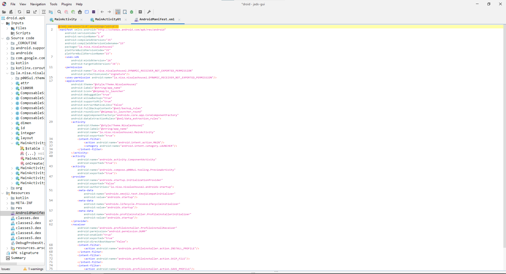

# Droid :
## Category
Reverse
## Description
this is not the android you're looking for
## File 
<a href="droid.apk">droid.apk</a>

## Solution

First I checked in android Manifest if there any revelant informations



Not revelant.

Go check the main Activity file. 


As we can see, there are key and expected array. Key contains the key to encrypt flag and expected is the encrypted Flag.

The "ComposerKt.reuseKey"'s value is : **207**

Below in code we can observe a xor loop :


```java
int[] result = new int[expected.length];
        int length = expected.length;
        for (int i = 0; i < length; i++) { // For loop to recover flag
            result[i] = text.charAt(i) ^ key[i];
        }
```

To retrieve flag we can use xor like that:

flag ^ key = expected

we can do this : 

expected ^ key = flag

So we create an apk to decrypt flag:

See source code <a href="droid.zip">here</a>


## Flag
**squ1rrel{k0tl1n_is_c001_n1s4l4}**
